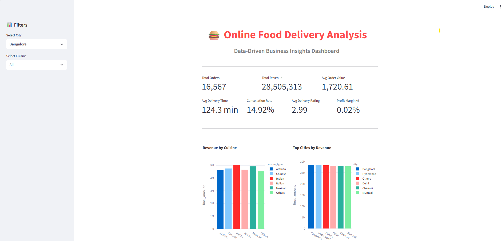
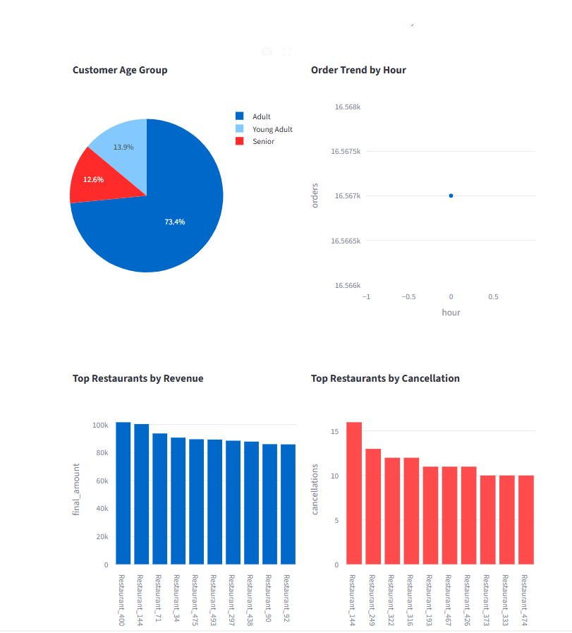
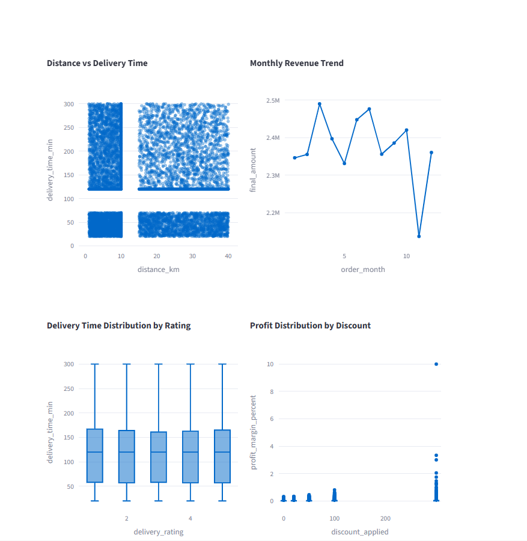
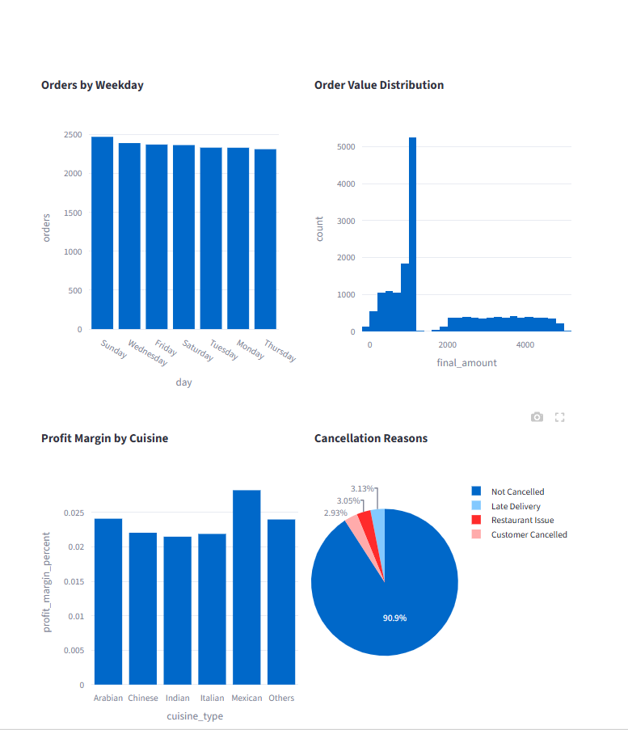
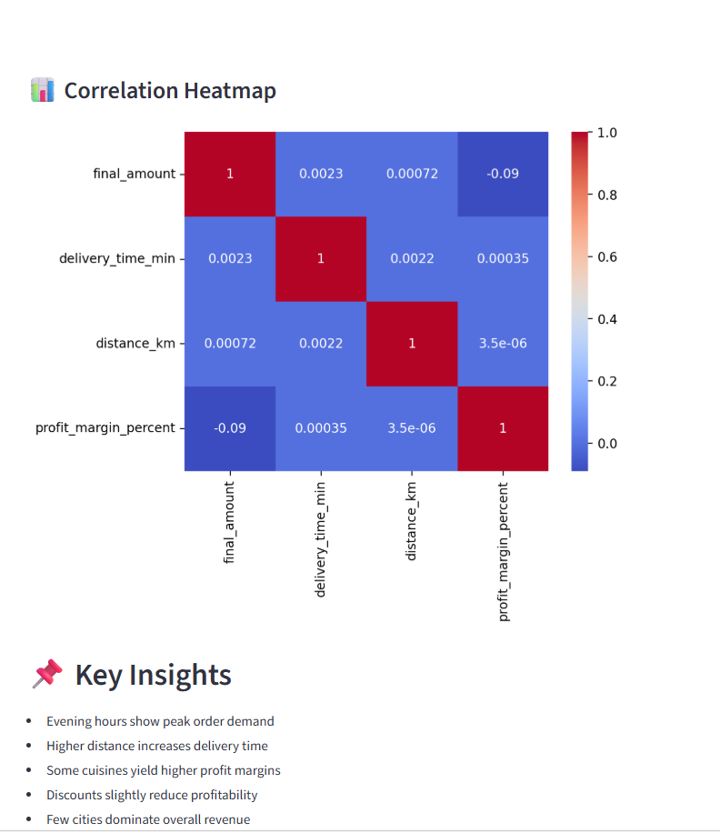

# 🍔 Online Food Delivery Analytics Pipeline

## 📌 Project Overview

This project builds an end-to-end data analytics pipeline for an online food delivery platform.
Raw transactional data is cleaned, transformed, stored in SQL, and visualized using an interactive dashboard.

The goal is to generate actionable business insights related to customer behavior, delivery performance, revenue, and restaurant operations.

---

## 🧠 Problem Statement

Online food delivery platforms generate large volumes of raw, noisy data. This project analyzes that data to:

* Understand customer ordering behavior
* Identify delivery inefficiencies
* Evaluate restaurant performance
* Track revenue, profit, and cancellations
* Enable data-driven decision-making

---

## ⚙️ Tech Stack

* **Python** (Pandas, NumPy)
* **SQL (MySQL)**
* **Streamlit** (Dashboard)
* **Plotly** (Visualization)

---

## 🔄 Data Pipeline

```text
Raw CSV Data
   ↓
Data Cleaning (Python)
   ↓
MySQL (cleaned_data)
   ↓
Feature Engineering
   ↓
MySQL (engineered_food_delivery)
   ↓
Streamlit Dashboard
```

---

## 🧹 Data Cleaning

* Handled missing values using median/mode
* Treated outliers using IQR method
* Fixed invalid values (ratings > 5, negative profit)
* Standardized categorical data
* Created datetime features

---

## 🛠 Feature Engineering

* Customer Age Group
* Delivery Performance (Fast / Moderate / Delayed)
* Profit Margin %
* Peak Hour Indicator
* Time-based features (Month, Hour, Weekday)

---

## 📊 Key KPIs

* Total Orders
* Total Revenue
* Average Order Value
* Average Delivery Time
* Cancellation Rate
* Average Delivery Rating
* Profit Margin %

---

## 📸 Dashboard Preview










---

## 📈 Key Insights

* Peak demand occurs during evening hours
* Longer distances increase delivery time
* Few cities dominate total revenue
* Discounts slightly reduce profit margins
* Certain cuisines are more profitable

---

## ⚠️ Challenges

* Handling real-world messy data
* Managing outliers and inconsistencies
* Designing meaningful KPIs
* Integrating SQL with Python pipeline

---

## 🚀 Future Improvements

* Real-time data pipeline
* Machine learning for delivery prediction
* Customer segmentation models
* Recommendation system

---

## 📁 Project Structure

```text
online_food_delivery_analysis/
 ├── assets/
 │    ├── kpi.png
 │    └── charts.png
 ├── data/
 ├── scripts/
 ├── streamlit_app/
 └── README.md
```

---

## 🏁 Conclusion

This project demonstrates how raw data can be transformed into meaningful business insights using a structured analytics pipeline.

---

## 🙌 Author

Balaji Venkatesan
